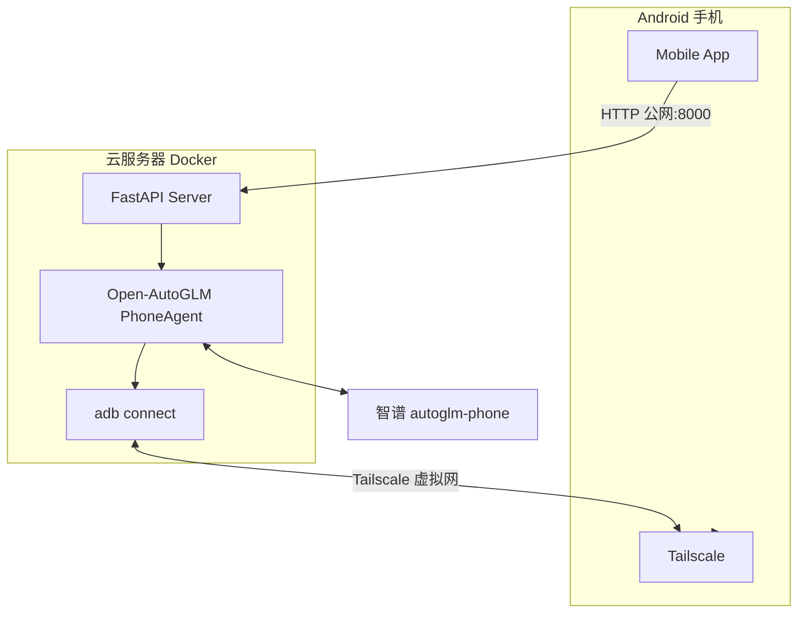

# AutoGLM Mobile Copilot (Cloud)

基于 [Open-AutoGLM](https://github.com/zai-org/Open-AutoGLM) 的手机 GUI Agent 云端部署版。

FastAPI 后端运行在云服务器（Docker），通过 Tailscale 与无线 ADB 远程控制 Android 手机。手机 App 使用公网地址访问后端，例如 `http://服务器IP:8000`。

## 相关仓库

| 版本 | 仓库 | 连接方式 |
| --- | --- | --- |
| USB | [USB-Autoglm-Mobile-Copilot](https://github.com/ginny-pjj/USB-Autoglm-Mobile-Copilot) | USB 数据线 + 本地后端 |
| WiFi | [WIFI-Autoglm-Mobile-Copilot](https://github.com/ginny-pjj/WIFI-Autoglm-Mobile-Copilot) | 同 WiFi 无线 ADB + 本地后端 |
| **Cloud（本仓库）** | [CLOUD-Autoglm-Mobile-Copilot](https://github.com/ginny-pjj/CLOUD-Autoglm-Mobile-Copilot) | 云服务器 + 远程 ADB |

系列说明见 [USB 仓库 SERIES.md](https://github.com/ginny-pjj/USB-Autoglm-Mobile-Copilot/blob/main/SERIES.md)。

---

## 系统架构



本地电脑在运行时**不需要**保持开启；仅在部署维护或重新配置手机 ADB 时可能需要。

---

## 功能

| 模块 | 说明 |
| --- | --- |
| Docker 部署 | FastAPI + Open-AutoGLM + adb |
| 远程 ADB | Tailscale + 无线调试 |
| Mobile App | 公网发任务、查看 Trace |
| 远程优化 | 截图超时/压缩、非交互 Take_over 处理 |

---

## 环境要求

- 云服务器（推荐 Ubuntu 22.04，2 核 4G 起）
- Docker / docker compose
- 手机：开发者选项 + 无线调试 + Tailscale
- 智谱 API Key

---

## 快速部署

```bash
git clone https://github.com/ginny-pjj/CLOUD-Autoglm-Mobile-Copilot.git
cd CLOUD-Autoglm-Mobile-Copilot
cp server/.env.cloud.example server/.env.cloud
# 编辑 BIGMODEL_API_KEY、ADB_CONNECT_ADDRESS 等
docker compose up -d --build
curl http://127.0.0.1:8000/health
```

详细步骤见 [docs/cloud-deploy.md](docs/cloud-deploy.md)。

---

## 演示视频

[GitHub Releases](https://github.com/ginny-pjj/CLOUD-Autoglm-Mobile-Copilot/releases)

推荐演示任务：`打开美团搜索蜜雪冰城`

---

## 文档

- [云端部署](docs/cloud-deploy.md)
- [架构说明](docs/architecture.md)
- [phone_agent 目录对照](docs/phone_agent-目录对照.md)
- [常见问题](docs/faq.md)

---

## 致谢

基于 [zai-org/Open-AutoGLM](https://github.com/zai-org/Open-AutoGLM)，遵循上游 License。

请勿提交 API Key、服务器 IP 或 Tailscale 地址。
